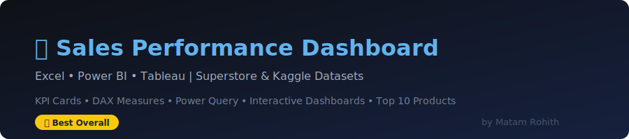

# 📊 Sales Performance Dashboard ⭐⭐⭐⭐⭐

> **Best Overall Data Analytics Portfolio Project**



## 🚀 Live Demo
🌐 **[View Live Dashboard →](https://matam-rohith.github.io/sales-performance-dashboard/)**

---

## 📌 Project Overview

A comprehensive **Sales Performance Dashboard** built using **Excel**, **Power BI**, and **Tableau** to analyze retail sales data from the Superstore and Kaggle datasets. This project demonstrates end-to-end data analysis skills including data cleaning, transformation, visualization, and storytelling.

---

## 🛠️ Tools & Technologies

| Tool | Purpose |
|------|--------|
|  | Pivot Tables, Charts, Data Cleaning |
|  | DAX, KPI Cards, Power Query, Interactive Filters |
|  | Interactive Dashboards, Story Points |

---

## 📂 Datasets Used

### 1. Superstore Sales Dataset
- **Source:** [Kaggle - Superstore Sales](https://www.kaggle.com/datasets/vivek468/superstore-dataset-final)
- **Records:** 9,994 rows × 21 columns
- **Fields:** Order ID, Order Date, Ship Mode, Customer, Segment, Region, Category, Sub-Category, Sales, Quantity, Discount, Profit

### 2. Kaggle Sales Data
- **Source:** [Kaggle - Sales Data](https://www.kaggle.com/datasets/kyanyoga/sample-sales-data)
- **Records:** 2,823 rows × 25 columns
- **Fields:** Order Number, Quantity, Price, Order Line, Sales, Order Date, Status, Product Line, MSRP, Product Code, Customer Name, Country

---

## 📊 Dashboard Features

### 📈 KPI Cards
- 💰 **Total Sales** — Overall revenue metric
- 📦 **Total Orders** — Count of all transactions
- 📉 **Total Profit** — Net profit across all regions
- 🔄 **Profit Margin %** — Profitability ratio
- 🛒 **Average Order Value** — Mean transaction size

### 📅 Monthly Sales Analysis
- Month-over-month sales trend line
- Seasonal pattern detection
- Year-over-year comparison

### 💹 Profit Analysis
- Profit by Category and Sub-Category
- Loss-making products identified
- Discount vs. Profit correlation

### 🗺️ Region-wise Sales
- Geographic heatmap
- East / West / Central / South breakdown
- State-level drill-down

### 📦 Category-wise Performance
- Furniture | Office Supplies | Technology
- Sub-category contribution charts
- Category profitability matrix

### 🏆 Top 10 Products
- Top 10 by Sales Revenue
- Top 10 by Profit
- Top 10 by Quantity Sold

### 🎛️ Interactive Filters
- Date Range Slicer
- Region Filter
- Category Filter
- Customer Segment Filter

---

## 🧠 Skills Demonstrated

### Microsoft Excel
- ✅ Pivot Tables & Pivot Charts
- ✅ VLOOKUP / XLOOKUP / INDEX-MATCH
- ✅ Conditional Formatting
- ✅ Data Validation
- ✅ Dynamic Named Ranges
- ✅ Advanced Charts (Combo, Waterfall, Funnel)

### Power BI
- ✅ DAX Measures & Calculated Columns
- ✅ Power Query (M Language) transformations
- ✅ KPI Cards & Gauge Charts
- ✅ Drill-through & Drill-down
- ✅ Row-Level Security (RLS)
- ✅ Custom Tooltips

### Tableau
- ✅ Calculated Fields
- ✅ Parameters & Sets
- ✅ Dashboard Actions
- ✅ Story Points
- ✅ Geographic Maps
- ✅ LOD Expressions

---

## 📁 Project Structure

```
sales-performance-dashboard/
├── 📄 README.md
├── 📁 datasets/
│   ├── README.md              ← Dataset download instructions
│   └── sample_data.csv        ← Sample data (100 rows)
├── 📁 excel/
│   └── sales_analysis.md      ← Excel step-by-step guide
├── 📁 powerbi/
│   ├── dashboard_guide.md     ← Power BI DAX & setup guide
│   └── dax_formulas.md        ← All DAX measures
├── 📁 tableau/
│   └── tableau_guide.md       ← Tableau dashboard guide
├── 📁 docs/
│   └── index.html             ← GitHub Pages live preview
└── 📁 assets/
    └── preview-banner.svg     ← Project banner
```

---

## 🎯 Key Insights (from Analysis)

1. **Technology** category has highest sales but **Office Supplies** has best profit margin
2. **Q4 (Oct-Dec)** consistently shows peak sales — holiday season effect
3. **West region** leads in sales; **South region** has lowest performance
4. High discounts (>40%) on **Furniture** cause consistent losses
5. **Canon imageCLASS** is the #1 product by revenue

---

## 👤 Author

**Matam Rohith**
- 🌐 Portfolio: [rohith-portfolio-six.vercel.app](https://rohith-portfolio-six.vercel.app/)
- 💼 GitHub: [@Matam-Rohith](https://github.com/Matam-Rohith)
- 📍 Telangana, India

---

## 📜 License

This project is licensed under the **MIT License** — see [LICENSE](LICENSE) for details.

---

<p align="center">⭐ Star this repo if you found it helpful!</p>
